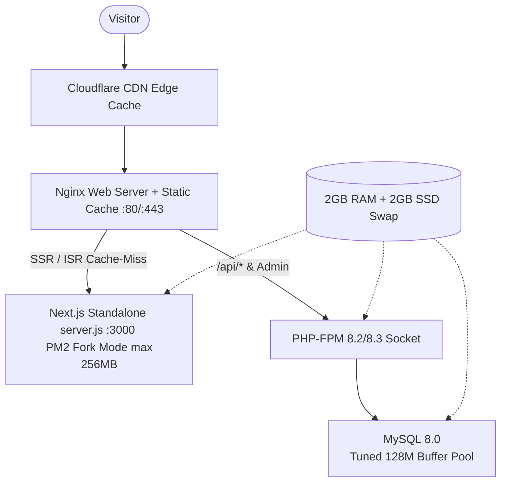

# Panduan Lengkap: Deployment Standalone `delta-nusantara-persada` ke VPS (Optimasi 2 vCPU / 2 GB RAM / 20 GB SSD)

Dokumen ini adalah panduan resmi dan teruji untuk mendeploy project `delta-nusantara-persada` (Frontend Next.js 14 Standalone & Backend Laravel 11) ke server VPS Ubuntu/Debian spesifikasi hemat resource (2 vCPU, 2 GB RAM, 20 GB SSD) dengan stabilitas maksimal, zero-crash, dan proteksi OOM.

---

## 1. Arsitektur Solusi & Alokasi Resource



| Komponen | Alokasi RAM | Konfigurasi Utama |
| :--- | :--- | :--- |
| **OS & Nginx** | ~350 MB | Swap 2 GB di SSD + Gzip Compression |
| **Next.js 14** | ~200–256 MB | `output: 'standalone'`, PM2 Fork Mode (`instances: 1`) |
| **PHP-FPM** | ~300–400 MB | Dynamic ondemand pool (max 10-15 worker) |
| **MySQL 8.0** | ~200–256 MB | `innodb_buffer_pool_size = 128M`, `performance_schema = OFF` |
| **Swap File** | 2 GB (SSD) | Buffer pelindung saat `npm run build` / traffic spikes |

---

## 2. Prasyarat Server VPS & Setup Swap 2 GB

Jalankan di server VPS Ubuntu 22.04 / 24.04:

```bash
# 1. Update OS & Konfigurasi Swap 2 GB (Wajib untuk RAM 2GB)
sudo apt update && sudo apt upgrade -y
sudo fallocate -l 2G /swapfile
sudo chmod 600 /swapfile
sudo mkswap /swapfile
sudo swapon /swapfile
echo '/swapfile none swap sw 0 0' | sudo tee -a /etc/fstab

# 2. Install Paket Inti & Web Server
sudo apt install -y git curl ufw nginx certbot python3-certbot-nginx

# 3. Install Node.js 20 LTS & PM2
curl -fsSL https://deb.nodesource.com/setup_20.x | sudo -E bash -
sudo apt install -y nodejs
sudo npm install -g pm2

# 4. Install PHP 8.2/8.3 & Ekstensi Laravel
sudo apt install -y php-fpm php-cli php-mysql php-mbstring php-xml php-bcmath php-curl php-zip php-gd unzip

# 5. Install Composer
curl -sS https://getcomposer.org/installer | php
sudo mv composer.phar /usr/local/bin/composer
```

---

## 3. Tuning MySQL 8.0 untuk RAM Terbatas

Buka konfigurasi MySQL:
```bash
sudo nano /etc/mysql/mysql.conf.d/mysqld.cnf
```

Tambahkan di bawah blok `[mysqld]`:
```ini
[mysqld]
performance_schema = OFF
innodb_buffer_pool_size = 128M
innodb_log_buffer_size = 8M
max_connections = 50
```

Restart MySQL:
```bash
sudo systemctl restart mysql
```

---

## 4. Langkah Clone Sparse-Checkout

```bash
# 1. Buat direktori aplikasi
sudo mkdir -p /var/www/delta-nusantara/deltagroup
sudo chown -R $USER:$USER /var/www/delta-nusantara/deltagroup
cd /var/www/delta-nusantara/deltagroup

# 2. Clone metadata monorepo (Blobless)
git clone --filter=blob:none --no-checkout https://github.com/USERNAME/delta-group.git .

# 3. Sparse-Checkout hanya delta-nusantara-persada
git sparse-checkout init --cone
git sparse-checkout set delta-nusantara-persada
git checkout main
```

---

## 5. Setup Backend Laravel 11

```bash
cd /var/www/delta-nusantara/deltagroup/delta-nusantara-persada/backend

# 1. Install dependensi
composer install --no-dev --optimize-autoloader

# 2. Konfigurasi Environment
cp .env.example .env
nano .env
```

Sesuaikan nilai `.env`:
```env
APP_NAME="PT Delta Nusantara Persada"
APP_ENV=production
APP_KEY=
APP_DEBUG=false
APP_URL=https://api.deltanusa.co.id

DB_CONNECTION=mysql
DB_HOST=127.0.0.1
DB_PORT=3306
DB_DATABASE=dnp_production
DB_USERNAME=dnp_user
DB_PASSWORD=PasswordKuatDatabase123!
```

Jalankan perintah optimasi:
```bash
php artisan key:generate
php artisan storage:link
php artisan migrate --force
php artisan config:cache
php artisan route:cache
php artisan view:cache
sudo chown -R www-data:www-data storage bootstrap/cache
sudo chmod -R 775 storage bootstrap/cache
```

---

## 6. Setup Frontend Next.js 14 Standalone

Masuk ke folder frontend:
```bash
cd /var/www/delta-nusantara/deltagroup/delta-nusantara-persada/frontend

# 1. Install dependensi
npm ci

# 2. Konfigurasi Environment
cat << 'EOF' > .env.local
NEXT_PUBLIC_API_URL=https://api.deltanusa.co.id/api
NEXT_PUBLIC_SITE_URL=https://deltanusa.co.id
REVALIDATION_SECRET=GantiSecretKeyAcak2026!
NEXT_PUBLIC_ADMIN_USER=admin_dnp
NEXT_PUBLIC_ADMIN_PASS=GantiDenganPasswordAman2026!
EOF

# 3. Build Standalone Bundle
npm run build

# 4. Copy static assets ke folder standalone Next.js
cp -r public .next/standalone/delta-nusantara-persada/frontend/
cp -r .next/static .next/standalone/delta-nusantara-persada/frontend/.next/

# 5. Jalankan dengan PM2 Fork Mode
pm2 start ecosystem.config.js
pm2 save
pm2 startup
```

---

## 7. Konfigurasi Nginx dengan Static Cache Headers

Edit file virtual host Nginx:
```bash
sudo nano /etc/nginx/sites-available/deltanusa.conf
```

Paste konfigurasi teroptimasi berikut:

```nginx
# 1. FRONTEND NEXT.JS (deltanusa.co.id)
server {
    server_name deltanusa.co.id www.deltanusa.co.id;

    # Gzip Compression
    gzip on;
    gzip_types text/plain text/css application/json application/javascript text/xml application/xml application/xml+rss text/javascript image/svg+xml;
    gzip_min_length 256;

    # Static Assets Caching
    location /_next/static/ {
        alias /var/www/delta-nusantara/deltagroup/delta-nusantara-persada/frontend/.next/static/;
        expires 365d;
        access_log off;
        add_header Cache-Control "public, max-age=31536000, immutable";
    }

    location /images/ {
        alias /var/www/delta-nusantara/deltagroup/delta-nusantara-persada/frontend/public/images/;
        expires 30d;
        access_log off;
        add_header Cache-Control "public, max-age=2592000";
    }

    # Proxy ke Node.js PM2 Standalone (:3000)
    location / {
        proxy_pass http://127.0.0.1:3000;
        proxy_http_version 1.1;
        proxy_set_header Upgrade $http_upgrade;
        proxy_set_header Connection 'upgrade';
        proxy_set_header Host $host;
        proxy_cache_bypass $http_upgrade;
        proxy_set_header X-Real-IP $remote_addr;
        proxy_set_header X-Forwarded-For $proxy_add_x_forwarded_for;
        proxy_set_header X-Forwarded-Proto $scheme;
    }
}

# 2. BACKEND LARAVEL API (api.deltanusa.co.id)
server {
    server_name api.deltanusa.co.id;
    root /var/www/delta-nusantara/deltagroup/delta-nusantara-persada/backend/public;

    add_header X-Frame-Options "SAMEORIGIN";
    add_header X-Content-Type-Options "nosniff";

    index index.php;
    charset utf-8;

    # Storage Media Caching
    location /storage/ {
        expires 30d;
        access_log off;
        add_header Cache-Control "public, max-age=2592000";
        try_files $uri =404;
    }

    location / {
        try_files $uri $uri/ /index.php?$query_string;
    }

    location = /favicon.ico { access_log off; log_not_found off; }
    location = /robots.txt  { access_log off; log_not_found off; }

    error_page 404 /index.php;

    location ~ \.php$ {
        fastcgi_pass unix:/var/run/php/php8.2-fpm.sock; # Sesuaikan versi PHP
        fastcgi_param SCRIPT_FILENAME $realpath_root$fastcgi_script_name;
        include fastcgi_params;
    }

    location ~ /\.(?!well-known).* {
        deny all;
    }
}
```

Aktifkan konfigurasi & terapkan SSL:
```bash
sudo ln -s /etc/nginx/sites-available/deltanusa.conf /etc/nginx/sites-enabled/
sudo nginx -t
sudo systemctl reload nginx
sudo certbot --nginx -d deltanusa.co.id -d www.deltanusa.co.id -d api.deltanusa.co.id
```

---

## 8. Script Otomasi Update (`deploy.sh`)

Edit `/var/www/delta-nusantara/deltagroup/deploy.sh`:

```bash
#!/bin/bash
set -e

echo "🚀 [1/4] Git pull update delta-nusantara-persada..."
cd /var/www/delta-nusantara/deltagroup
git pull origin main

echo "📦 [2/4] Optimasi Backend Laravel..."
cd delta-nusantara-persada/backend
composer install --no-dev --optimize-autoloader --quiet
php artisan migrate --force
php artisan config:cache
php artisan route:cache
php artisan view:cache
sudo chown -R www-data:www-data storage bootstrap/cache

echo "⚡ [3/4] Build Frontend Next.js Standalone..."
cd ../frontend
npm ci --silent
npm run build
cp -r public .next/standalone/delta-nusantara-persada/frontend/
cp -r .next/static .next/standalone/delta-nusantara-persada/frontend/.next/
pm2 reload ecosystem.config.js

# Bersihkan build cache lama agar disk 20GB tidak penuh
rm -rf .next/cache

echo "✅ [4/4] Deployment Berhasil! Sistem berjalan stabil tanpa downtime."
```

Beri izin eksekusi:
```bash
chmod +x /var/www/delta-nusantara/deltagroup/deploy.sh
```
