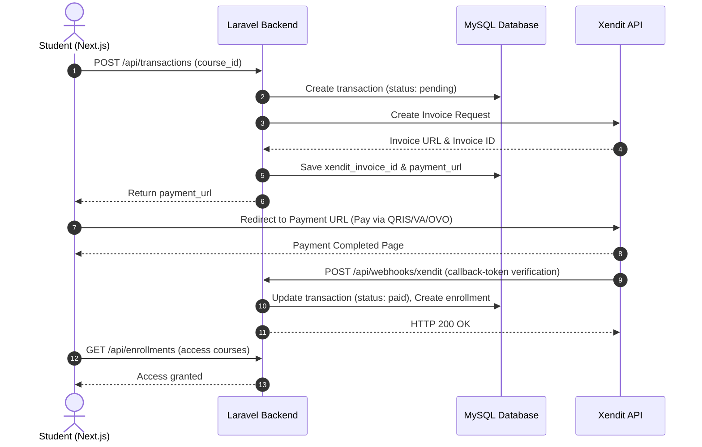

# CMS, Course Selling & Xendit Payment Integration Plan

This plan outlines the architecture, database changes, and integration steps for introducing a Content Management System (CMS), Course Catalog, Checkout Flow, and Xendit Payment Gateway integration across the PT. Delta Indonesia Group web applications.

---

## User Review Required

Please review the following architectural decisions and confirm your preferred direction:

> [!IMPORTANT]
> **1. Multi-Tenant Backend vs. Multi-Instance Deployments**
> Currently, the codebase uses a single-tenant structure where each brand has its own directory and separate database (e.g. `delta_indonesia`, `delta_nusantara_persada`).
> *   **Proposal**: We maintain the current pattern by implementing the CMS, Course, and Payment systems in the core `delta-indonesia/backend` master project. The other projects can copy this updated backend template and configure their own `.env` files (e.g., `DB_DATABASE`, `XENDIT_SECRET_KEY`, `XENDIT_CALLBACK_TOKEN`). This guarantees complete data isolation for different legal entities.
> *   *Alternative*: We consolidate into a single multi-tenant database where a `brand_id` column filters courses, transactions, and users.

> [!WARNING]
> **2. Authentication System for Learners**
> Currently, only administrators have auth endpoints (Laravel Sanctum) to publish blog posts.
> *   **Proposal**: We introduce a `role` column in the `users` table (`admin`, `student`). Students will register and log in via the frontend to view purchased courses and track progress. We will build standard registration, email verification, and password reset flows.

---

## Open Questions

> [!IMPORTANT]
> 1. **Course Content Types**: Do courses contain pre-recorded video lessons (e.g., Vimeo, YouTube, AWS S3), downloadable PDFs, or live webinar links (Zoom)? This impacts how we design the Lesson schema and video-player security.
> 2. **Certification Generation**: Is dynamic PDF certificate generation required upon completing a course? (This is standard for K3 certifications). If so, we should plan to install a PHP PDF library (like `barryvdh/laravel-dompdf`).
> 3. **Tax and Admin Fees**: Should Xendit payment checkout include tax (PPN) or administrative/transaction fees added to the base course price?

---

## Proposed Changes

We will implement changes in both frontend (Next.js 14) and backend (Laravel) components.

### 1. Database Schema Additions

We will create migrations for the following tables in the Laravel backend:

#### `courses`
*   `id` (BIGINT, PK, Auto Increment)
*   `title` (VARCHAR)
*   `slug` (VARCHAR, Unique)
*   `description` (TEXT)
*   `price` (DECIMAL 10,2)
*   `cover_image` (VARCHAR, Nullable)
*   `is_active` (BOOLEAN, Default: true)
*   `timestamps`

#### `modules` (Course Chapters)
*   `id` (BIGINT, PK)
*   `course_id` (FOREIGN KEY -> `courses.id`, Cascade on delete)
*   `title` (VARCHAR)
*   `order` (INT)
*   `timestamps`

#### `lessons` (Course Lessons)
*   `id` (BIGINT, PK)
*   `module_id` (FOREIGN KEY -> `modules.id`, Cascade on delete)
*   `title` (VARCHAR)
*   `content_type` (ENUM: 'video', 'document', 'quiz')
*   `content_body` (TEXT, stores video URL or markdown text)
*   `order` (INT)
*   `timestamps`

#### `enrollments` (Student course access)
*   `id` (BIGINT, PK)
*   `user_id` (FOREIGN KEY -> `users.id`)
*   `course_id` (FOREIGN KEY -> `courses.id`)
*   `progress_percentage` (INT, Default: 0)
*   `status` (ENUM: 'active', 'completed')
*   `completed_at` (TIMESTAMP, Nullable)
*   `timestamps`

#### `lesson_completions` (Tracks student progress)
*   `id` (BIGINT, PK)
*   `user_id` (FOREIGN KEY -> `users.id`)
*   `lesson_id` (FOREIGN KEY -> `lessons.id`)
*   `created_at` (TIMESTAMP)

#### `transactions` (Xendit Payments)
*   `id` (BIGINT, PK)
*   `user_id` (FOREIGN KEY -> `users.id`)
*   `course_id` (FOREIGN KEY -> `courses.id`)
*   `invoice_number` (VARCHAR, Unique)
*   `amount` (DECIMAL 10,2)
*   `status` (ENUM: 'pending', 'paid', 'expired', 'failed')
*   `xendit_invoice_id` (VARCHAR, Nullable)
*   `payment_url` (VARCHAR, Nullable)
*   `paid_at` (TIMESTAMP, Nullable)
*   `timestamps`

---

### 2. Backend API Changes

#### Auth Routes (`/api/auth`)
*   `POST /api/auth/register` - Create learner accounts.
*   `POST /api/auth/login` - Sanctum token creation (supporting both student & admin roles).

#### Course Catalog (Public)
*   `GET /api/courses` - List active courses with pagination/filters.
*   `GET /api/courses/{slug}` - View course syllabus and details.

#### Course Learning (Protected - Students Only)
*   `GET /api/enrollments` - List enrolled courses.
*   `GET /api/enrollments/{course_slug}/lessons` - Load lessons and completions.
*   `POST /api/lessons/{id}/complete` - Mark a lesson as completed.

#### Checkout & Payment Gateways (Protected)
*   `POST /api/transactions` - Generate a course order and create Xendit Invoice.
*   `POST /api/webhooks/xendit` (Public, verification via callback token) - Update status and activate enrollment upon payment.

#### Course Admin CMS (Protected - Admins Only)
*   `POST /api/admin/courses` - Create course metadata.
*   `POST /api/admin/courses/{id}/modules` - Add syllabus chapters.
*   `POST /api/admin/courses/{id}/lessons` - Add video/text materials.
*   `GET /api/admin/transactions` - Track sales history and invoice lists.

---

### 3. Frontend Next.js Pages

We will add the following pages under the `frontend/` codebase (particularly `delta-lembaga-kursus` and `delta-indonesia-pranenggar`):

#### Client Portal
*   `/courses` - Course directory with responsive filters and categories.
*   `/courses/[slug]` - Course detail showing syllabus list, trainers, duration, and checkout prompt.
*   `/dashboard` - Student dashboard with course progress bars, active certificates, and quick resume.
*   `/dashboard/learn/[course_slug]` - Video player interface with sidebar navigation of lessons and checkbox completions.

#### Admin CMS Workspace
*   `/admin/courses` - CRUD list of courses.
*   `/admin/courses/[id]/builder` - Drag-and-drop hierarchy editor for modules and lessons.
*   `/admin/sales` - Dashboard showing transaction analytics, Xendit status, and certificate issuance records.

---

## Verification Plan

### Automated Tests
*   **PHPUnit test suite**: Test database operations for transactions, webhooks, and enrollments.
*   **Mock Xendit API calls**: Use Xendit sandbox credentials to test payment generation.
*   **Webhook Simulation**: Test `POST /api/webhooks/xendit` with verified header tokens to ensure seamless student enrollment activation.

### Manual Verification
*   Complete end-to-end checkout path using Xendit Sandbox payment links.
*   Verify that video player screens load properly across mobile/desktop viewports.
